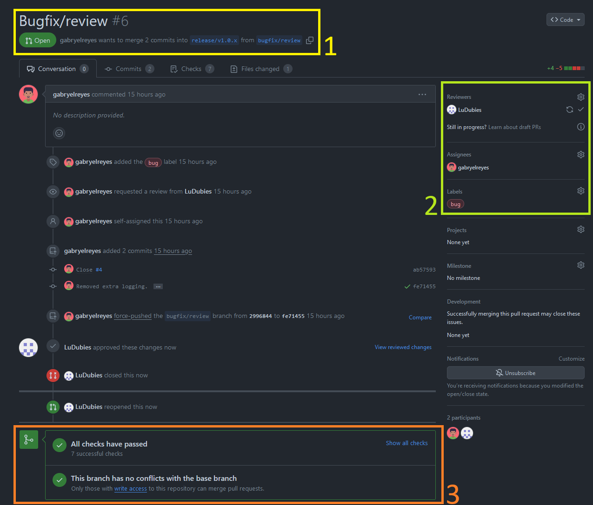

# Pull Requests

Some aspects of the Pull Request (PR) interface are highlighted on this page.

## Introduction

A Pull Request is a useful mechanism to integrate changes and new additions into the existing code. Instead of just merging changes made in a `feature` or `bugfix` branch into a `release` branch, the Pull Request allows the creator of the changes to present all of their work to their collaborators. They must review these changes before they are added to the more stable branches.

You can find information on where Pull Requests are mandatory on the [branches page](./branch_types.md).

## Anatomy of a Pull Request

A Pull Request in GitHub looks like this:

1. The status of the PR, the source and target branches are also shown. Below that, all the user actions are detailed chronologically. The "Files changed" tab allows for a detailed view of the changes, allowing reviewers and creator to exchange comments and requests.

2. The creator of the pull request and all invited reviewers and their approval status are shown.

3. On the bottom of the page, the proposed changes are automatically checked for potential conflicts using [Continous Integration](../ci/ci.md). If enough approved reviews are conducted and all tests are successful, a collaborator with write access to the target branch can merge the Pull Request.
