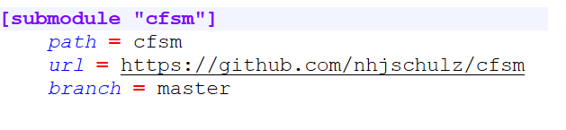
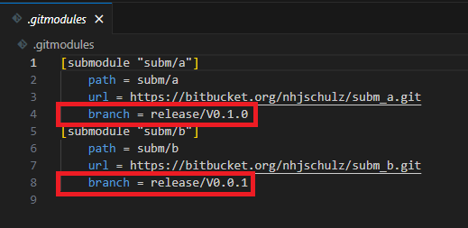
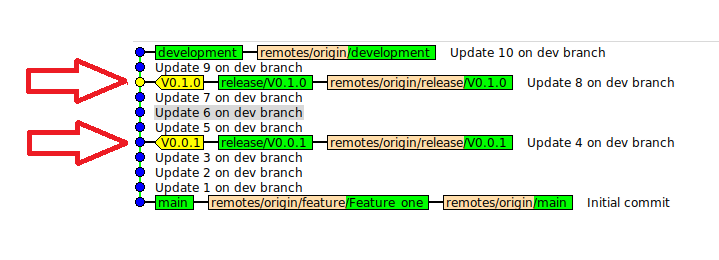
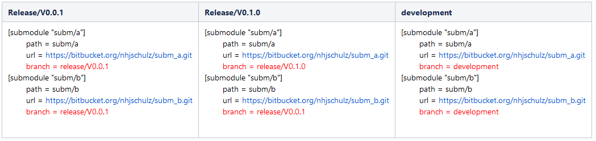

<style>
table, th, td {
  border: 1px solid;
  border-collapse: collapse;
}
</style>

# Software Configuration Management with GIT Submodules

* [Abstract](#abstract)
* [Used Terminology](#used-terminology)

* [Git Submodules](#git-submodules)
* [Versioning of Submodules via Branches](#versioning-of-submodules-via-branches)
* [Git Commands for Different Use Case](#git-commands-for-different-use-cases)

## Abstract

The goal of configuration management is to manage and maintain all
components used for the creation of a software system, so that all
users of this software work with defined versions.
This article describes a method using the GIT version control system and
submodules to implement detailed versioning of software based system.
The basic idea of this method is to divide a software system into
components that are individually versioned. It is suitable for projects
with high functional safety requirements. The administrative overhead
for all project participants should be kept as low as possible. The
configuration should remain simple to change and document.

## Used Terminology

### Repository

A repository in this method is a "standard" Git repository.
All items stored inside such a repository share the version history and
are versioned together "as a whole". This means that each component with
individual versioning needs its own GIT repository.

### Reference

A reference  is a GIT submodule definition to a commit
inside another GIT repository. These are managed with GIT commands or
manual editing of the .gitmodules file. The anatomy of such a reference
in .gitmodules looks like this:



Each used submodule is defined by such a section within the
.gitmodules file.
The "submodule" line holds the name of the submodule. By default it is
the same as the path entry, but can be customized (--name option for
submodule add). The entries for "path" and "url" are always present,
branch is optional.

* The path field determines the file path where the submodule will apear
  within the working copy of the referencing repository.
* The url field is the access path to the submodule repository. It is
  the same URL that is used for a "git clone" of the submodule
  repository..
* The "branch" field is optional. It only exists if you want the base
  repository to follow a branch of the submodule. It will be used
  consistently later when applying this method.

### Components

A component is defined as a part of a system that can be versioned
individually. A complete system is created by assembling all components
with specific versions. The division of a system into individual
components is defined at project level. The method only defines an
abstract component model with three hierarchical levels:

```{plantuml}
skinparam linetype ortho

[Base Component] <<repo>> #DarkGray
[SubSystem] <<repo>> #DarkSeaGreen
[Component] <<repo>>

[Base Component] -d-> "0..* " [SubSystem] : <<Reference>>
[Base Component] -d-> "0..*  " [Component] : <<Reference>>
[SubSystem] -d-> "1..* " [Component] : <<Reference>>
```

#### Base Component

A "Base" component represents the complete system as a top-level
element. It defines the complete system as a composition based on
references to other components. Creating a working copy of the system
always starts with this component. Most project use exactly one base
component. Multiple base components can be useful, if a project contains
independent sub-projects. A base component consists of

* The basic system content of the project, for example the directory
  tree, project level documentation and scripts for project management
  (tools, build scripts ....)

* References to other versioned components.

#### Subsystem Component

A "subsystem" component is a composition of components similar to a base
component. It supports the creation of versioned subsystems, which in
turn consist of components. An example of such a subsystem component is
a communication stack that is composed of services, protocols and device
drivers. The use of subsystems must be decided at the project level.
They allow for a finer structuring of the system, but also increase the
effort required for its configuration. For each subsystem, the
references to its components must be maintained in addition to those of
the base component. The content of a subsystem component is analogous to
the base component, but limited to the scope of the subsystem.

#### Component

A "component" forms the lowest level in the hierarchy. It represents a
partial aspect of the complete system that is no longer subdivided. It
contains only one a file tree with no further references to other
components.

## Git Submodules

### Introduction

This configuration method is based on the GIT Submodule functionality
for the recursive composition of GIT repositories. This functionality is
applied 1:1 to the composition of components via references. There is no
separate tooling required. Any GIT tutorial can be used to get a basic
understanding of the GIT submodules (Example:
[https://git-scm.com/book/en/v2/Git-Tools-Submodules](https://git-scm.com/book/en/v2/Git-Tools-Submodules)).
A disadvantage of GIT submodules is the need to deal with additional GIT
commands or options for standard operations such as "clone" and
"checkout" of branches (e.g. "git checkout development
**--recurse-submodules** "). But this is defined by GIT and not caused
by this methodology.

### Complexity of Submodule Versioning

GIT manages submodules in two distinct places within a repository:

* Via the .gitmodules file in the root directory of a repository
* Within the repository index under .git/modules and in .git/config.

The settings in the .gitmodules file are under version control and
visible to a user in the working copy. But sadly this file is primarily
used to register submodules (URL + checkout path). The effectively used
version is a reference to a commit id of the submodule, which is stored
in the index and not in the .gitmodules file. This leads to the
following problems:

* The contents of the .gitmodules file does not contain all the
  information about a submodule configuration.
* It is not possible to specify the commit id via a tag within the
  .gitmodules file.
* The GIT submodule commands only show commit hashes. Used labels and
  branches must be determined via additional detours.

This complicates both the configuration and the documentation of the
used versions for a complete system. Ideally this should be visible
from a central location, e.g. within the .gitmodules files.
Unfortunately tags are not supported there to request defined
versions of submodules. An alternative to the missing tags support is
possible via branches by using the optional "branch" entry. This avoids
the problems above without having to invent additional scripting/tooling
for the versioning. It can then be managed completely via .gitmodules
based on branches.

## Versioning of Submodules via Branches

The central idea of the method is a consequent use of branches for
submodules for both, development and configuration management. The
versions of the components are controlled **only** using "branch"
entries in .gitmodules. This restriction has the following benefits:

* The configuration of the complete system is entirely defined by the
  .gitmodules files in the base component and any subsystem component.
* The component configuration is documented and easily readable by
  everyone when checking out a configuration.
* The configuration documentation is ensured to be correct as it is also
  read and used by the GIT operations.
* The workflows for creating development and release versions are the
  same.

These branches should be read-only once created, as they can be used as trackers for the submodule file.

Example:



In this example, the system uses two submodules named "subm/a" and
"subm/b". Each one is pointing to a branch within its subsystem
repository.

### Tagging and Branching of Submodule Versions

The used version of a component is typically marked by a tag. A tag is
hardwired to a commit, which then reliably represents the desired
state of this version. GIT unfortunately only supports branches and no
tags within the .gitmodules file. This method therefore uses branches as
an alternative to the tag in versioning. GIT then follows ("tracks")
this branch, which means that the submodule commit of the branch HEAD
will get used. This leads to an obvious problem compared to tags usage.
Pushes to a branch change its HEAD and as such leave the originally
versioned commit. This problem can be mitigated as follows.

* GIT repository hosting environments like Github or BitBucket support
  rights management for branches. It is possible to prohibit the
  modification of certain branches or restrict them to privileged users.
  A branch behaves then logically in the same way as a tag. It always
  represents the same commit.
* The ability to change a release branch may even be desirable if bug
  fixes are to be performed during release phases. However, further
  changes after the release phase need to be avoided.
* An additional release **Tag** gets created that is pointing to the
  same commit as the branch HEAD. The "git submodule status" command
  then shows, if the branch has moved away from this label by further
  commits. This allows an unintentional change to be detected, for
  example by a script inside an CI system.

### Creating a Component Version

When a component is ready for versioning, the following steps are
performed:

1. A release tag is created on the targeted commit: "git tag -m
   "Release X.Y.Z" VX.Y.Z \<commit-id\>"
2. A release branch is created from the above release tag: "git branch
   release/vX.Y.Z VX.Y.Z"
3. The tags and the branch are "pushed".

A successful creation of a component version will then looks like this:



There is a label and a release branch for each release. The release
branches are pushed.

### Live Example

A demo repository for demonstrating the submodule versioning with
branches is available in BitBucket. The clone URL is
<https://bitbucket.org/nhjschulz/base.git>.

#### Create a local clone of the repo example including the submodules

```bash
$ git clone https://bitbucket.org/nhjschulz/base.git --recurse-submodules
Cloning into 'base'...
<..>
Submodule path 'subm/a': checked out 'c776b6f3ae2e58de0b1dd05302b48004b23492c5'
Submodule path 'subm/b': checked out 'ee28a60fabf10470991d83615021650987885c71'
$ cd base
$ git branch -a
* main
remotes/origin/HEAD -> origin/main
remotes/origin/development
remotes/origin/main
remotes/origin/release/v0.0.1
remotes/origin/release/v0.1.0
```

Important is the use of the "--recurse-submodules" option for the clone command.
The submodules will not be loaded in the context of cloning without this
option. But they can still be loaded later on using additional GIT
commands.
In addition to the "main" branch, the repository also contains release
branches and a "development" branch.

#### Checkout Release V0.0.1

```bash
$ git checkout release/v0.0.1  --recurse-submodules
branch 'release/v0.0.1' set up to track 'origin/release/v0.0.1'.
Switched to a new branch 'release/v0.0.1'
$ git submodule status
 1cc129c0c4bba38384149e53a1143b8b4a370a30 subm/a (V0.0.1)
 ee28a60fabf10470991d83615021650987885c71 subm/b (V0.0.1)
```

The repository working copy is now represents the release V0.0.1 state.
The submodule repositories are also using "initial" version number.
Note that each submodule uses its own "release/v0.0.1" branch here.

#### Checkout Release V0.1.0

```bash
$ git checkout release/v0.1.0  --recurse-submodules
branch 'release/v0.1.0' set up to track 'origin/release/v0.1.0'.
Switched to a new branch 'release/v0.1.0'
$ git submodule status
 c776b6f3ae2e58de0b1dd05302b48004b23492c5 subm/a (V0.1.0)
 ee28a60fabf10470991d83615021650987885c71 subm/b (V0.0.1)
 ```

The switch to release V0.1.0 also changed the version of submodule
"subm/a". It also advanced to V0.1.0. The second submodule "subm/b"
didn't switch in this version and is still using the V0.0.1.

#### Checkout a Development Branch

```bash
$ git checkout development  --recurse-submodules
branch 'development' set up to track 'origin/development'.
Switched to a new branch 'development'
$ git submodule status
 382a28f0d54609483a6843c5f13d879868b7b809 subm/a (V0.1.0-2-g382a28f)
 ef9039e996aba89c30c75fecd8fb0a82e32bc1bf subm/b (V0.0.1-4-gef9039e)
 ```

The switch to branch development has affected both submodules. The
cryptic output **V0.1.0-2-g382a28f** in this case means that we are two
commits behind the label V0.1.0 on commit "382a28f...". It shows
that we no longer have tagged versiones of the submodules in our working
copy. But since we're on a "development" branch, that's probably what we
expect. We likely got the latest state of these components now.

#### Versioning via .gitmodules

The versioning of complete demo system got defined exclusively by the
base component (there had been no additional subsystem components).
Release branches of the base component refer to well defined versions of
the submodule inside the .gitmodules file. Here is an overview of the
various .gitmodules contents of the branches in the base component. They
differ only in the value of the branch field. This is exactly the
desired effect of this method. The .gitmodules file together with the
base component version define and documents the versioning of the entire
system.



## Git Commands for Different Use Cases

This section shows GIT command examples for various versioning use
cases. In many cases, there are alternative commands that lead to same
results. The commands shown here are considered examples to get started
using submodule versioning. Advanced users may follow other routes or
add scripts for automation. Commands using **bold font** in the left
column are to be executed inside the folder of the submodule component.
Otherwise the base component folder will be used.

### Creating a Repository with Submodules

<table>
<colgroup>
<col style="width: 20%" />
<col style="width: 30%" />
<col style="width: 50%" />
</colgroup>
<thead>
<tr class="header">
<th>Commands</th>
<th>Description</th>
<th>Example</th>
</tr>
</thead>
<tbody>
<tr class="odd">
<td>mkdir &lt;<em>name&gt;</em></td>
<td>Creation of an empty folder for the base component named "name"</td>
<td>

    $ mkdir basis

</td>
</tr>
<tr class="even">
<td>cd <em>&lt;name&gt;</em></td>
<td>Switching into the base component repository. </td>
<td>

    $ cd basis

</td>
</tr>
<tr class="odd">
<td>git init</td>
<td>Creation of a new Git Repository
<td><p>

    $ git init
    Initialized empty Git repository in
    /home/norbert/basis/.git/

</td>
</tr>
<tr class="even">
<td>git submodule add &lt;repo_url&gt; &lt;local_relative_path&gt;</td>
<td>Adding submodules. This command is repeated for each submodule.</td>
<td>

    $ git submodule add https://bitbucket.org/nhjschulz/subm_a.git submod/a
    Cloning into '/home/norbert/basis/submod/a'...
    remote: Enumerating objects: 36, done.
    remote: Counting objects: 100% (36/36), done.
    remote: Compressing objects: 100% (26/26), done.
    remote: Total 36 (delta 0), reused 0 (delta 0), pack-reused 0 (from 0)
    Receiving objects: 100% (36/36), done.
</td>
</tr>
<tr class="odd">
<td>git status</td>
<td>Check the current status. Adding submodules resulted in changes that
need to be checked in.<br>A directory got created for each submodule and
the .gitmodules file was created or extended.</td>
<td>

    $ git status
    On branch master

    No commits yet

    Changes to be committed:
      (use "git rm --cached <file>..." to unstage)
            new file:   .gitmodules
            new file:   submod/a
</td>
</tr>
<tr class="even">
<td>git commit -a -m "&lt;msg&gt;"</td>
<td>Check-in and commit of the modified submodule definitions.</td>
<td>

      $ git commit -a -m "Added Submodule  https://bitbucket.org/nhjschulz/subm_a.git"
      [master (root-commit) 1054429] Added Submodule  https://bitbucket.org/nhjschulz/subm_a.git
       2 files changed, 4 insertions(+)
       create mode 100644 .gitmodules
       create mode 160000 submod/a
  </td>
  </tr>
  </tbody>
  </table>

### Cloning a Repo with Submodules

<table>
<colgroup>
<col style="width: 20%" />
<col style="width: 30%" />
<col style="width: 50%" />
</colgroup>
<thead>
<tr class="header">
<th>Commands</th>
<th>Description</th>
<th>Example</th>
</tr>
</thead>
<tbody>
<tr class="odd">
<td>git clone &lt;url&gt; &nbsp; --recurse-submodules</td>
<td><p>Initial cloning of a repository including all submodules. This is
achieved by using the "--recurse-submodules" option.</p>

<p>Use the following commands if "--recurse-submodules" has been
forgotten during clone. This option is primarily a convenience to do
this automatically:</p>
<p>$ git submodule init<br>
Submodule 'subm/a' (https://bitbucket.org/nhjschulz/subm_a.git) registered for path
'subm/a'<br>
Submodule 'subm/b' (https://bitbucket.org/nhjschulz/subm_b.git) registered for path
'subm/b</p>
<p>'$ git submodule update</p>
<p>Cloning into '/home/norbert/submod_cfgmgmt/base/subm/a'...<br>
Cloning into '/home/norbert/submod_cfgmgmt/base/subm/b'...<br>
Submodule path 'subm/a': checked out
'c776b6f3ae2e58de0b1dd05302b48004b23492c5'<br>
Submodule path 'subm/b':checked out 'ee28a60fabf10470991d83615021650987885c71'</p>
</td>
<td>

    $ git clone https://bitbucket.org/nhjschulz/base.git --recurse-submodules
    Cloning into 'base'...
    remote: Enumerating objects: 34, done.
    remote: Counting objects: 100% (34/34), done.
    remote: Compressing objects: 100% (31/31), done.
    remote: Total 34 (delta 9), reused 0 (delta 0), pack-reused 0 (from 0)
    Receiving objects: 100% (34/34), done.
    Resolving deltas: 100% (9/9), done.
    Submodule 'subm/a' (https://bitbucket.org/nhjschulz/subm_a.git) registered for path 'subm/a'
    Submodule 'subm/b' (https://bitbucket.org/nhjschulz/subm_b.git) registered for path 'subm/b'
    Cloning into '/home/norbert/submod_cfgmgmt/base/subm/a'...
    remote: Enumerating objects: 36, done.
    remote: Counting objects: 100% (36/36), done.
    remote: Compressing objects: 100% (26/26), done.
    remote: Total 36 (delta 0), reused 0 (delta 0), pack-reused 0 (from 0)
    Receiving objects: 100% (36/36), done.
    Cloning into '/home/norbert/submod_cfgmgmt/base/subm/b'...
    remote: Enumerating objects: 29, done.
    remote: Counting objects: 100% (29/29), done.
    remote: Compressing objects: 100% (21/21), done.
    remote: Total 29 (delta 1), reused 0 (delta 0), pack-reused 0 (from 0)
    Receiving objects: 100% (29/29), done.
    Resolving deltas: 100% (1/1), done.
    Submodule path 'subm/a': checked out 'c776b6f3ae2e58de0b1dd05302b48004b23492c5'
    Submodule path 'subm/b': checked out 'ee28a60fabf10470991d83615021650987885c71' '
</td>
</tr>
</tbody>
</table>

#### Updating the Repository

<table>
<colgroup>
<col style="width: 20%" />
<col style="width: 30%" />
<col style="width: 50%" />
</colgroup>
<thead>
<tr class="header">
<th>Commands</th>
<th>Description</th>
<th>Example</th>
</tr>
</thead>
<tbody>
<tr class="odd">
<td>git pull</td>
<td>The base repository is updated by a pull. It updates the base
component working copy, but does not touch the submodules yet.</td>
<td>

    $ git pull
    remote: Enumerating objects: 1, done.
    remote: Counting objects: 100% (1/1), done.
    remote: Total 1 (delta 0), reused 0 (delta 0), pack-reused 0 (from 0)
    Unpacking objects: 100% (1/1), 149 bytes | 149.00 KiB/s, done.</td>
</tr>
<tr class="even">
<td>git submodule update --init --recursive --remote</td>
<td>The submodules are updated to the commits of the branch HEADs as
defined by the .gitmodules file.</td>
<td>

    $ git submodule update --init --recursive --remote
    Submodule path 'subm/a': checked out'382a28f0d54609483a6843c5f13d879868b7b809'
</td>
</tr>
</tbody>
</table>


Git pull also offers a "--recurse-submodules" option, which automatically adjusts the submodules as well.
However, this only works with already known submodules.
If new entries appear in .gitmodules with the pull, they will not be processed and a
"submodule update" will still be necessary. It is currently more safe to go with
the sequence of pull and "submodule update".


(Changing a Submodule Branch)= <!-- !!! keep this link anchor, because referenced later !!! -->
#### Changing a Submodule Branch

This scenario describes the change of a submodule to another existing
branch.

* Integrators use it to update submodules to point to new versions. In
  this case, the base component should be on an integration branch.
* Developers use this to set submodules to a development branch for
  further development. In this case, the base component should be also
  on a development branch (e.g. feature/x or development).

<table>
<colgroup>
<col style="width: 20%" />
<col style="width: 30%" />
<col style="width: 50%" />
</colgroup>
<thead>
<tr class="header">
<th>Commands</th>
<th>Description</th>
<th>Example</th>
</tr>
</thead>
<tbody>
<tr class="odd">
<td>git checkout &lt;branch&gt;</td>
<td>Set the base component to the target branch (integration or
development branch).</td>
<td>

      $ git checkout development
      Switched to branch 'development'
      Your branch is up to date with 'origin/development'.
</td>
</tr>
<tr class="even">
<td>git submodule set-branch --branch &lt;branch&gt; &lt;module&gt;</td>
<td>Create a branch entry for a submodule in .gitmodules. This command
is repeated for all submodules whose branch is to be switched.</td>
<td>

      $ git submodule set-branch --branch development subm/a
</tr>
<tr class="odd">
<td>git diff</td>
<td><p>With <strong>git diff</strong> you can see that the branch of the
submodule has been changed inside .gitmodules.</p>

```{note}
Only the entry in the .gitmodules file has been adjusted.
The submodule versions in the working copy have not (yet) changed.
```

</td>
<td>

    $ git diff
    diff --git a/.gitmodules b/.gitmodules
    index 7cb7f77..01af15d 100644
    --- a/.gitmodules
    +++ b/.gitmodules
    @@ -1,7 +1,7 @@
        [submodule "subm/a"]
        path = subm/a
        url = https://bitbucket.org/nhjschulz/subm_a.git
    -   branch = release/v0.1.0<br />
    +   branch = development<br />
    [submodule "subm/b"]<br />
      path = subm/b<br />
      url = https://bitbucket.org/nhjschulz/subm_b.git
</tr>
<tr class="even">
<td>git submodule update --recursive --remote</td>
<td>Apply the changes in .gitmodules to the submodules. This sets the
commit reference in the index to the HEAD of the branch and checks it
out. The "--remote" causes changes from the upstream submodule repository
to be fetched first, and then switch to the HEAD of the branches.</td>
<td>

    $ git submodule update --recursive --remote
    Submodule path 'subm/a': checked out '382a28f0d54609483a6843c5f13d879868b7b809'
</td>
</tr>
<tr class="odd">
<td>git status</td>
<td>A status check shows that we need to check in the changes to
.gitmodules and the and the module's directory. At least .gitmodules and
all changed submodule folders must be checked in.</td>
<td>

    $ git status
    On branch main
    Your branch is up to date with 'origin/main'.

    Changes not staged for commit:
    (use "git add <file>..." to update what will be committed)
    (use "git restore <file>..." to discard changes in working directory)
        modified:   .gitmodules
        modified:   subm/a (new commits)
</td>
</tr>
<tr class="even">
<td>git commit -a -m "&lt;msg&gt;"</td>
<td>Check in of the submodule branch changes.</td>
<td>

    $ git commit -a -m "Changed Submodule A to development branch"
    [main d695de1] Changed Submodule A to development branch
    2 files changed, 2 insertions(+), 2 deletions(-)
</td>
</tr>
</tbody>
</table>

### Working on a Submodule Patch

A GIT submodule is a normal GIT repository. It is only located within a
base repository, which monitors it for modifications. If you switch into
a submodule directory, all GIT commands for managing the submodule
repository are available. A special situation arises here, as submodules
are set to a specific commit during update/checkout from the base
repository. GIT calls this “detached HEAD” as there is no branch
context. To work in a submodule, it needs first to be switched back to a
branch. Unfortunately, the "branch" specification of the .gitmodules
file does not also cause this branch to be set. Only the HEAD commit of
the branch got checked out. You are on the same commit as the branch
HEAD, but still "detached" from branches.

The following scenario assumes strict version control at the component
level. This means that all components are set to released versions and
you have a defined configuration at the beginning. A component
(submodule) is now to be extended from this state.

<table>
<colgroup>
<col style="width: 20%" />
<col style="width: 30%" />
<col style="width: 50%" />
</colgroup>
<thead>
<tr class="header">
<th>Commands</th>
<th>Description</th>
<th>Example</th>
</tr>
</thead>
<tbody>
<tr class="odd">
<td>git checkout &lt;version&gt;</td>
<td>Check out the desired version in the base component.</td>
<td>

    $ git checkout release/v0.1.0
    Switched to branch 'release/v0.1.0'
    Your branch is up to date with 'origin/release/v0.1.0'.
</td>
</tr>
<tr class="even">
<td>cd &lt;submodule&gt;</td>
<td>Switch into the component you want to edit</td>
<td>

    $ cd subm/a
</tr>
<tr class="odd">
<td><p><strong>git status</strong></p>
<p><strong>git log &lt;ID&gt; -n 1</strong></p></td>
<td><p>Check the status of the component. As expected, we are on a
commit with no branch context.</p>
<p>The log command shows that this commit belongs to the V0.1.0 tag  .
Since we want to add a feature to this version, we create a new branch
for it in the next step.
</td>
<td>

    $ git status
    HEAD detached at c776b6f
    nothing to commit, working tree clean

    $ git log c776b6f -n 1
    commit c776b6f3ae2e58de0b1dd05302b48004b23492c5 (HEAD, tag: V0.1.0,origin/release/v0.1.0, release/v0.1.0)
    Author: Norbert Schulz <github@schulznorbert.de>
    Date:   Mon Sep 30 16:23:33 2024 +0200

        Update 8 on dev branch
</tr>
<tr class="even">
<td><strong>git checkout -b &lt;name&gt; &lt;tag&gt;</strong></td>
<td>Create a new branch to edit/update the component. Committing and
pulling of changes is possible after this step.</td>
<td>

    $ git checkout -b feature/new V0.1.0
    Switched to a new branch 'feature/new'

    $ git status
    On branch feature/new
    nothing to commit, working tree clean
</td>
</tr>
<tr class="odd">
<td><strong>&lt;edit&gt;</strong></td>
<td>"Featue New" gets implemented here.</td>
<td>

    $ echo "Feature/new is here" > README.md
</td>
</tr>
<tr class="even">
<td><strong>git commit -a -m "&lt;msg&gt;"</strong></td>
<td>Check-in of the changes.</td>
<td>

    $ git commit -a -m "Added Feature New"
    [feature/new 4cb7e76] Added Feature New
    1 file changed, 1 insertion(+), 1 deletion(-)
</td>
</tr>
</tbody>
</table>

The changes inside the submodule have impact on the base repository as well.
A "git status" in the base repository returns the following:

```bash
$ git status
On branch release/v0.1.0
Your branch is up to date with 'origin/release/v0.1.0'.

Changes not staged for commit:
  (use "git add <file>..." to update what will be committed)
  (use "git restore <file>..." to discard changes in working
directory)
        modified:   subm/a (new commits)

no changes added to commit (use "git add" and/or "git commit -a")
```

The base repository has detected that we are now on a different commit
in the modified submodule. If you want to share the new variant,
**you should not check in and push the changed folder** **now**. This will
create a contradiction between .gitmodules and the index commit link.
The previous version branch is still listed in .gitmodules, but the
commit hash in the submodule is the HEAD of the new branch. Possible
options to handle this situation are:

* Create a development branch in the base module and update the feature
  branch of the submodule inside .gitmodules and push. This creates a
  "tracking development branch" that can be shared with other
  developers.
* Create a new version of the submodule for integration and discard the
  local changes with "git submodule update --init --remote --recursive".
  An integrator then later generates an update of the base repository
  that targets the new version of the submodule.

#### Creating a Submodule Version

<table>
<colgroup>
<col style="width: 20%" />
<col style="width: 30%" />
<col style="width: 50%" />
</colgroup>
<thead>
<tr class="header">
<th>Commands</th>
<th>Description</th>
<th>Example</th>
</tr>
</thead>
<tbody>
<tr class="odd">
<td>cd &lt;submod-dir&gt;</td>
<td>Switch to the submodule to be versioned,</td>
<td>

    $ cd subm/a
</tr>
<tr class="even">
<td><p><strong>git fetch</strong></p>
<p><strong>git log</strong></p></td>
<td>Determine the commit hash to be versioned. This step is optional if
the hash is already known. The "git fetch" ensures that all existing
hashes are also known in the local repository.</td>
<td>

    $ git fetch
    $ git log
    commit 382a28f0d54609483a6843c5f13d879868b7b809 (HEAD, origin/development)
    Author: Norbert Schulz <github@schulznorbert.de>
    Date:   Mon Sep 30 16:23:33 2024 +0200

        Update 10 on dev branch

    commit 7f80e15fb9fdddbce08a4107082ecd6c49061bb1
    Author: Norbert Schulz <github@schulznorbert.de>
    Date:   Mon Sep 30 16:23:33 2024 +0200

        Update 9 on dev branch
    ...
</td>
</tr>
<tr class="odd">
<td><strong>git tag  -m "version &lt;version&gt;"
&lt;version_tag_name&gt; &lt;hash&gt;</strong></td>
<td>Assign a version tag for the desired commit. In the example it is
V2.0.0.</td>
<td>

    $ git tag -m "Release V2.0.0" V2.0.0 382a28f0d54609483a6843c5f13d879868b7b809
</tr>
<tr class="even">
<td><strong>git branch release/&lt;version&gt;
&lt;version_tag_name&gt;</strong></td>
<td>Create a version branch for the tag you just created.</td>
<td>

    git branch release/v2.0.0 V2.0.0
</tr>
<tr class="odd">
<td><strong>git push  --set-upstream origin
&lt;local_branch_name&gt;:&lt;remote_branch_name&gt;</strong></td>
<td>Make the new branch known in the "upstream" repository "origin". The
last parameter contains the branch name twice, separated by a colon. The
name on the left is the banch name in the local repository. The right
name will be the new branch in the "upstream" repository.</td>
<td>

    $ git push --set-upstream origin release/v2.0.0:release/v2.0.0
    To https://bitbucket.org/nhjschulz/subm_a.git
    (https://bitbucket.org/nhjschulz/subm_a.git)
     * [new branch]      release/v2.0.0 -> release/v2.0.0
    branch 'release/v2.0.0' set up to track 'origin/release/v2.0.0'.
</td>
</tr>
<tr class="even">
<td><strong>git push origin tag &lt;version_tag_name&gt;</strong></td>
<td>Make the release tag known to the "upstream" origin repository. A
"normal" push does not transfer tags.</td>
<td>

    $ git push origin tag V2.0.0
    Enumerating objects: 1, done.Counting objects: 100% (1/1), done.
    Writing objects: 100% (1/1), 169 bytes | 169.00 KiB/s, done.
    Total 1 (delta 0), reused 0 (delta 0), pack-reused0
    To https://bitbucket.org/nhjschulz/subm_a.git
      * [new tag]         V2.0.0
</td>
</tr>
</tbody>
</table>

To use the new version in the base repository, use the commands
from [Changing a Submodule Branch](#changing-a-submodule-branch) and use
the new branch name there.


#### Creating a New System Version

Creating a complete system version starts by creating a new version for
the base component. In this new version, the .gitmodules file will be
edited to update the references to new versions (=branches) of the
submodule components. The new versions for the submodules must already
be available before the update of the base component.

<table>
<colgroup>
<col style="width: 20%" />
<col style="width: 30%" />
<col style="width: 50%" />
</colgroup>
<thead>
<tr class="header">
<th>Commands</th>
<th>Description</th>
<th>Example</th>
</tr>
</thead>
<tbody>
<tr class="odd">
<td>git checkout &lt;Integration_Branch&gt;</td>
<td>In the base repository, the integration branch is checked out.</td>
<td>

    $ git checkout integration
    Switched to branch 'integration'
</td>
</tr>
<tr class="even">
<td>&lt;update der Submodule Versionen&gt;</td>
<td>On the Integrations branch, the .gitmodules file is edited. The
"branch" entries for components with new versions are adjusted. In the
example, the version of the subm/a component has been increased</td>
<td>

    $ vi .gitmodules$ git diff
    diff --git a/.gitmodules b/.gitmodules
    index 7cb7f77..62afcf6 100644
    --- a/.gitmodules
    +++ b/.gitmodules
    @@ -1,7 +1,7 @@
    [submodule "subm/a"]
        path = subm/a
        url = https://bitbucket.org/nhjschulz/subm_a.git
    -   branch = release/v0.1.0
    +   branch = release/v2.0.0
    [submodule "subm/b"]
        path = subm/b
        url = https://bitbucket.org/nhjschulz/subm_b.git
</td>
</tr>
<tr class="odd">
<td>git submodule update --init --remote --recursive</td>
<td><p>The working copy of the integration branch is updated to the new
component version. The "git status" shows the changes in the submodules
(only subm/a" has changed here).</p>
<p>A integrator may now perform smoke tests on this configuration and
check it in if successful.</p></td>
<td>

    $ git submodule update --init --remote --recursive
    Submodule path 'subm/a': checked out '382a28f0d54609483a6843c5f13d879868b7b809'

    $ git status
    On branch integration
    Changes not staged for commit:
      (use "git add <file>..." to update what will be committed)
      (use "git restore <file>..." to discard changes in working directory)
              modified:   .gitmodules
              modified:   subm/a (new commits)
      no changes added to commit (use "git add" and/or "git commit -a")
</td>
</tr>
<tr class="even">
<td><p>git commit -a -m "&lt;msg&gt;"</p>
<p>git push</p></td>
<td>The changes of the integration branch are checked into git and
pushed.<br />
Further tests can now be run on the integration branch, or a new version
can be created right away for testers to work with.</td>
<td>

    $ git commit -a -m "Preparing Release v2.0.0"
    [integration 3b811e2] Preparing Release v2.0.0
    2 files changed, 2 insertions(+), 2 deletions(-)

    $ git push
    Enumerating objects: 7, done.
    Counting objects: 100% (7/7), done.
    Delta compression using up to 22 threads
    Compressing objects: 100% (4/4), done.
    Writing objects: 100% (4/4), 391 bytes | 391.00 KiB/s, done.
    Total 4 (delta 2), reused 0 (delta 0), pack-reused 0
</td>
</tr>
<tr class="odd">
<td><p>git tag -m "Created version &lt;version&gt;"
&lt;tag_version&gt;</p>
<p>git push origin tag &lt;tag_version&gt;</p></td>
<td>A new base component version is created by setting a tag. Unlike
submodules, no branch necessarily has to be created here. The base
component is not included in .submodules.</td>
<td>

    $ git tag -m "Created version V2.0.0" V2.0.0

    $ git push origin tag V2.0.0
     * [new tag]         V2.0.0 -> V2.0.0
</td>
</tr>
<tr class="even">
<td><p>git branch release/&lt;version&gt; &lt;tag_version&gt;</p>
<p>git push  --set-upstream origin
&lt;local_branch_name&gt;:&lt;remote_branch_name&gt;</p></td>
<td>Optional: Create a release branch for the new version:</td>
<td>

    $ git branch release/v2.0.0 V2.0.0

    $ git push --set-upstream origin release/v2.0.0:release/v2.0.0
    * [new branch]      release/v2.0.0 ->; release/v2.0.0
    branch 'release/v2.0.0' set up to track 'origin/release/v2.0.0'.
</tr>
</tbody>
</table>
